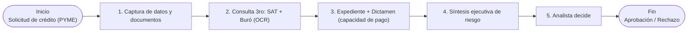

# KapitalFlex — Flujo de proceso de análisis de crédito

> Documento de seguimiento del proyecto, generado a partir de las notas y capturas de las sesiones de discovery.

**Estado:** 🟡 En validación con el cliente
**Última actualización:** ver historial de commits de este archivo

---

## Índice

- [1. Flujo As-Is vigente](#1-flujo-as-is-vigente)
- [2. Herramientas activas](#2-herramientas-activas)
- [3. Flujo As-Is original (v1 — notas iniciales, superado)](#3-flujo-as-is-original-v1--notas-iniciales-superado)
- [4. Datos que se utilizan](#4-datos-que-se-utilizan)
- [5. Preguntas abiertas](#5-preguntas-abiertas)

---

## 1. Flujo As-Is vigente

**Proceso actual:** sitio web de KapitalFlex + **Lendia** como backoffice.
**Syntage se usaba antes y ya no es parte del flujo vigente** (ver nota al final de esta sección).

```mermaid
flowchart TD
    subgraph F1["FASE 1 · Solicitud y captura"]
        A1["Simulación de crédito<br/><i>Monto, plazo y garantía en kapitalflex.com</i><br/><b>KAPITALFLEX WEB</b>"]
        A2["Alta de solicitud<br/><i>Ingresa a Backoffice Lendia, etapa 'Solicitado'</i><br/><b>LENDIA BPM</b>"]
        A3["Documentos Pre-Análisis<br/><i>SAT, Buró Empresas (D&B), Buró TransUnion, Declaración anual</i><br/><b>LENDIA</b>"]
        A1 --> A2 --> A3
    end

    subgraph F2["FASE 2 · Documentación y verificación"]
        B1["Expediente PYME<br/><i>Cliente / aval suben identificación, EECC, actas, comprobantes</i><br/><b>PORTAL EXPEDIENTE</b>"]
        B2["Buró de investigación legal<br/><i>Score y antecedentes verificados dentro de Lendia (antes vía Syntage, ya no se usa)</i><br/><b>LENDIA</b>"]
        B3["Perfil financiero automatizado<br/><i>Dashboard SAT, Buró de Crédito, alertas PLD, capacidad de pago</i><br/><b>LENDIA / AUTO</b>"]
        B1 --> B2 --> B3
    end

    subgraph F3["FASE 3 · Análisis y decisión"]
        C1["Perfil legal + Dictamen legal<br/><i>Revisión societaria y legal del expediente</i><br/><b>ANALISTA</b>"]
        C2["Definición de condiciones<br/><i>Monto, plazo, tasa, nivel de riesgo, comisión de apertura</i><br/><b>ANALISTA / COMITÉ</b>"]
        C3["Visita ocular + Revisión de control<br/><i>Verificación física del negocio</i><br/><b>ANALISTA</b>"]
        C1 --> C2 --> C3
    end

    subgraph F4["FASE 4 · Resolución"]
        D1["Generación de oferta<br/><i>Se envían condiciones al cliente para aceptación</i><br/><b>LENDIA BPM</b>"]
        D2["Resolución<br/><i>Autorizado / Rechazado / Perdieron interés</i><br/><b>LENDIA BPM</b>"]
        D3["Expediente final + desembolso<br/><i>Cierre del expediente y liberación del crédito</i><br/><b>LENDIA</b>"]
        D1 --> D2 --> D3
    end

    A3 --> B1
    B3 --> C1
    C3 --> D1
```

> **Nota:** Syntage era la herramienta usada anteriormente para el buró legal; hoy ese paso corre dentro de Lendia. Pendiente confirmar con el cliente qué reemplazó exactamente esa función (ver [Preguntas abiertas](#5-preguntas-abiertas)).

## 2. Herramientas activas

| Herramienta | Rol en el proceso |
|---|---|
| **Sitio web KapitalFlex** | Simulador público de crédito (monto, plazo, garantía) y captación del lead |
| **Lendia (BPM / backoffice)** | Sistema central: gestión de solicitudes, documentos pre-análisis, perfil financiero, dictamen, condiciones, resolución |
| **Portal de expediente** | Carga de documentación del cliente / aval (identificación, EECC, actas, comprobantes) |
| ~~Syntage~~ | ⚠️ Ya no se usa — antes cubría el buró de investigación legal |

---

## 3. Flujo As-Is original (v1 — notas iniciales, superado)

> Se conserva como referencia histórica de la primera sesión de discovery (07/07). **No refleja el proceso actual** — ver sección 1 para la versión vigente.

**Datos clave mencionados en esta versión:**

| Métrica | Valor |
|---|---|
| Tiempo total del crédito | 1–2 días |
| Solicitudes procesadas | 10–15 / día |
| Comisión de apertura | 5% (50% para partner Lendia) |
| Revisión línea revolvente / renovación completa | Anual / cada 3 años |

**Herramientas y partners mencionados:**

| Herramienta | Descripción |
|---|---|
| Syntage | Verifica cumplimiento regulatorio de la PYME *(hoy en desuso, ver sección 1)* |
| Lendia | Partner: tablero de análisis de crédito |
| OCR / SAT | Extracción automática de datos fiscales |
| Benchmark: Confío | Referencia para el onboarding digital |

**Productos mencionados:** Crédito simple, Crédito especial (check extendido), Renovar el crédito.

---

## 4. Datos que se utilizan

### Identificación y solicitud
- RFC, razón social / nombre comercial, tipo de persona (PFAE / Persona Moral)
- Monto y plazo solicitado, tipo de garantía (inmobiliaria / prendaria)
- Canal de origen (canal, subcanal, fuente, owner)

### Documentación fiscal *(vía Lendia)*
- Opinión de Cumplimiento de Obligaciones Fiscales (SAT)
- Constancia de Situación Fiscal
- Declaración Anual de Impuestos (últimos 2 ejercicios) + acuses

### Buró y antecedentes *(vía Lendia)*
- Reporte de Buró Empresas (Dun & Bradstreet)
- Reporte de Buró de Crédito (Trans Union)
- Validación PLD (OFAC, ONU, SAT/RFC, PEP/RPPF, SAT/69 y 69-bis)
- ⚠️ **Pendiente de confirmar:** verificación de antecedentes legales, SIC e Infonavit — antes las cubría Syntage; no está claro si Lendia las reemplaza o si hoy no se consultan.

### Identidad y domicilio *(vía portal de expediente)*
- Identificación oficial vigente, CURP
- Comprobante de domicilio fiscal / operativo / particular
- Reporte de investigación a referencias

### Financieros
- Estados de cuenta bancarios (últimos 3 meses)
- Estados financieros (revisión anual), relación de pasivos
- Ventas, compras, antigüedad, saldo vigente / vencido / liquidado
- Capacidad de pago, BC Score, capital contable

### Legal / societario
- Acta de asamblea ordinaria/extraordinaria
- Comprobación de la inversión
- Información de terceros participantes / aval-obligado solidario

### Negocio
- Actividad económica (giro SCIAN, con % de participación)
- Entidad federativa
- Operación de cumplimiento

### Condiciones de la oferta
- Tasa autorizada, comisión de apertura, monto y plazo autorizados
- Nivel de riesgo (%), días de validez de la oferta

---

## 5. Preguntas abiertas

### Sobre la transición de Syntage a Lendia
- [ ] ¿Qué reemplazó exactamente la función que hacía Syntage — es un módulo nuevo dentro de Lendia, o esa verificación (SIC, Infonavit, antecedentes legales) simplemente ya no se corre?
- [ ] Si ya no se consulta el SIC ni Infonavit, ¿hay algún otro control que cubra ese riesgo, o es un hueco de cumplimiento a día de hoy?
- [ ] ¿Desde cuándo se dejó de usar Syntage? ¿Fue una decisión deliberada (costo, redundancia) o una migración que quedó a medias?

### Sobre la arquitectura de herramientas
- [ ] ¿"Expediente PYME" (portal de expediente) y los "Documentos Pre-Análisis" de Lendia corren en paralelo o uno depende del otro?
- [ ] ¿El portal de expediente es un desarrollo propio de KapitalFlex, un proveedor externo, o el mismo producto mencionado como "Avanza" en la primera reunión?

### Sobre las reglas de negocio
- [ ] ¿Qué dispara exactamente el "Rechazo Automático — Sin Abortivos"?
- [ ] ¿La Tasa Autorizada los calcula Lendia automáticamente o los define el analista/comité manualmente?
- [ ] Explicar el resto del flujo como visita ocular, revisión control y firma de contrato.
- [ ] ¿Qué criterio mueve una solicitud de "Solicitado" a "Flujo Revisión"? (Por los tipos de créditos)
- [ ] ¿Qué define que una solicitud caiga en "Perdieron interés"? ¿Hay algun costo contemplado, se puede volver a evaluar al mismo cliente luego?

### Sobre datos y costos
- [ ] ¿Cuánto cuesta cada consulta que hace Lendia (SAT, Buró TransUnion, Dun & Bradstreet)? 5%? a nivel operativo
- [ ] Con giros económicos múltiples, ¿cómo pondera el sistema el riesgo por giro?

---
